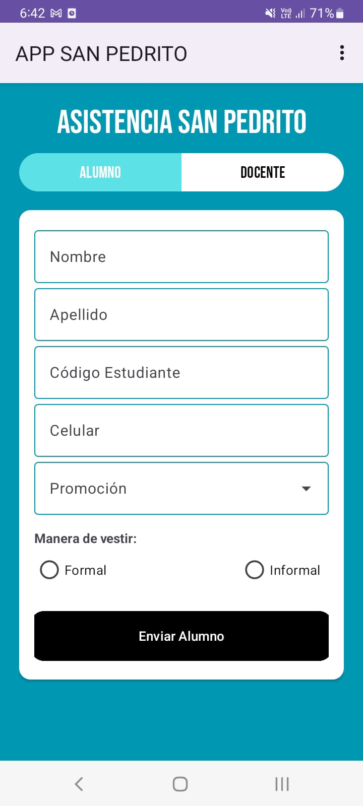
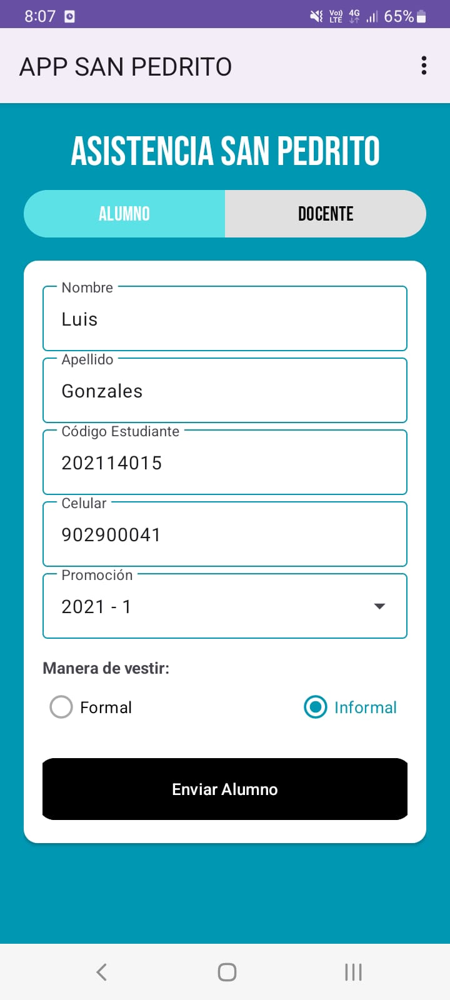
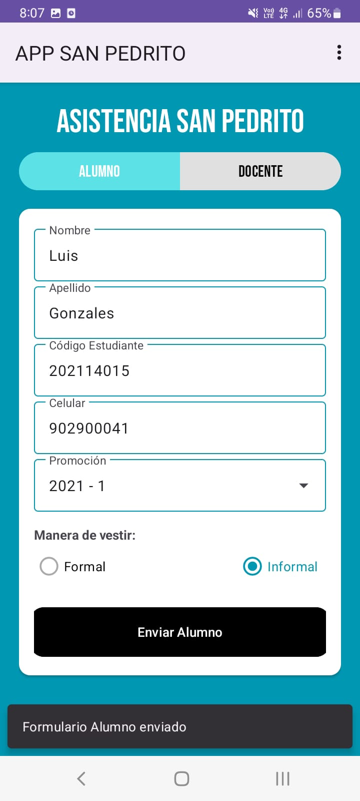
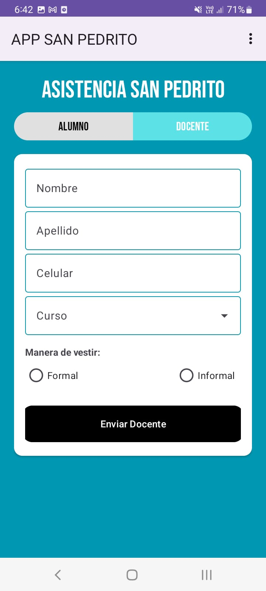
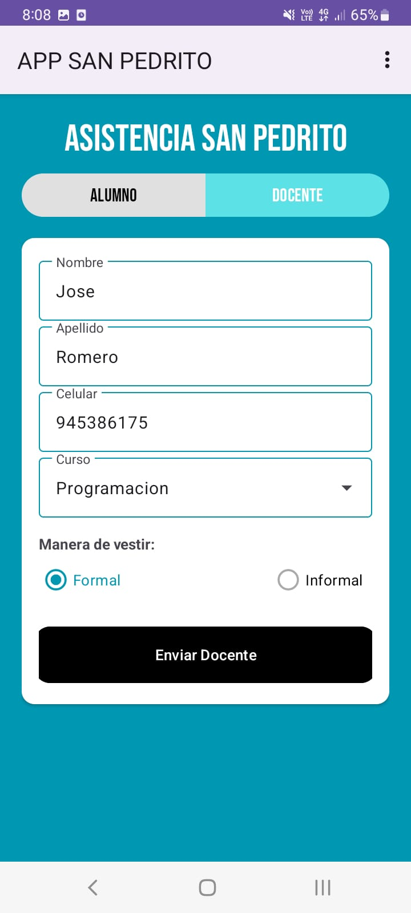
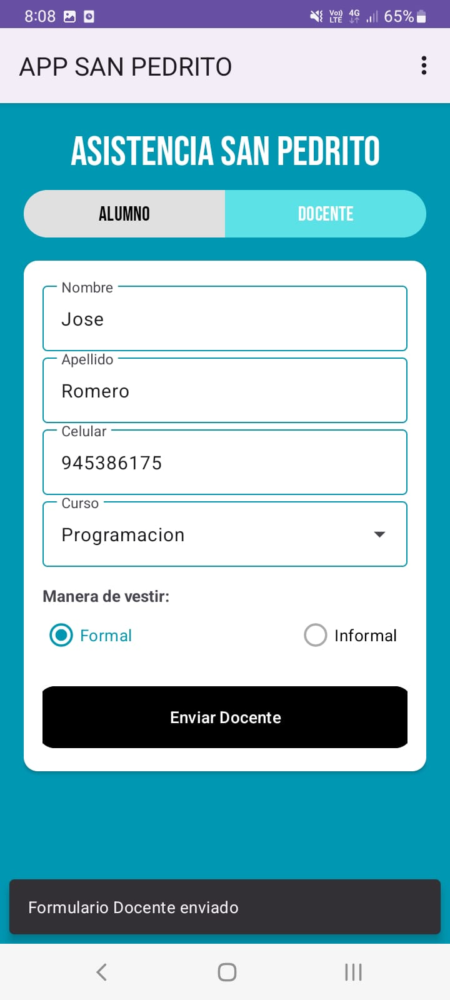
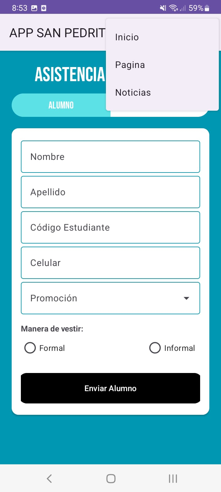
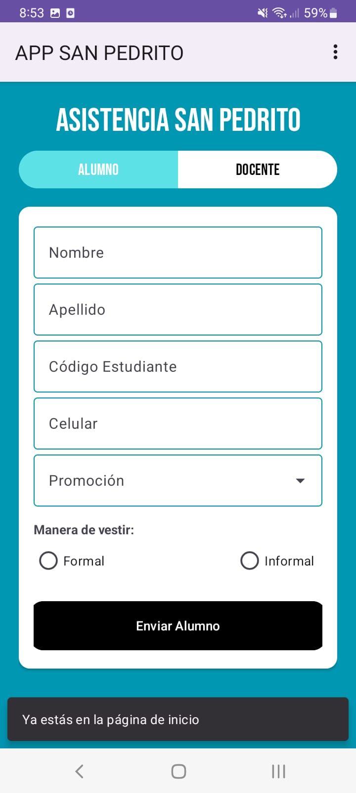
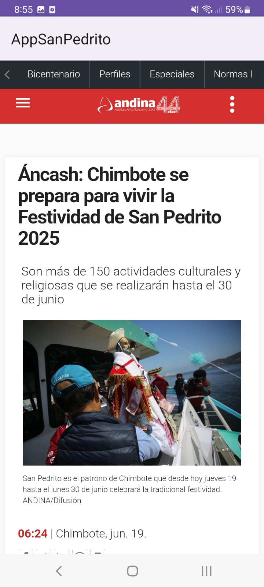
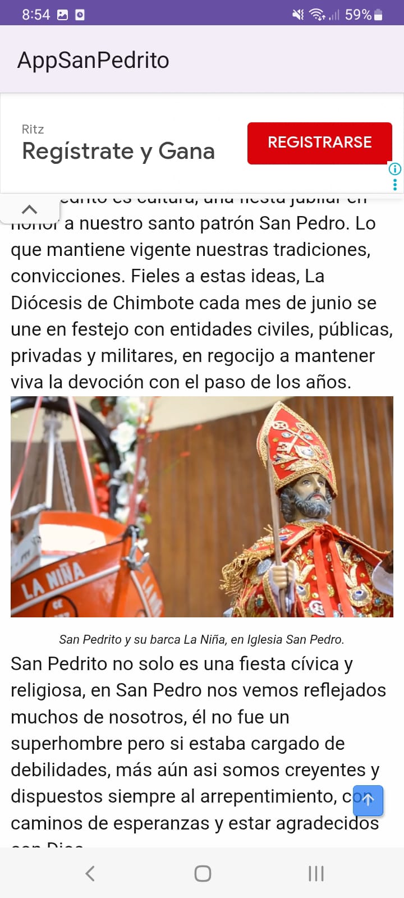

# 🎉 APP San Pedrito

**Aplicación móvil para el registro de asistencia al desfile por el aniversario de San Pedrito para alumnos y doncentes de EPISI**

## 📋 Descripción

**APP San Pedrito** es una aplicación Android desarrollada en Kotlin, diseñada para registrar la asistencia de alumnos y docentes de la Escuela Profesional de Ingeniería de Sistemas e Informática al desfile por el aniversario de San Pedrito.  
La aplicación cuenta con formularios intuitivos, un menú de opciones para navegar entre secciones, y una WebView para mostrar contenido web institucional relevante.

## 🎯 Objetivo

Brindar una herramienta digital eficiente que permita a los organizadores registrar de manera ordenada y segura la asistencia de los participantes al evento, reduciendo el uso de papel y mejorando la organización.

## 🚀 Funcionalidades

- 📄 Registro de asistencia para alumnos y docentes mediante formularios
- ✅ Validación de campos antes del envío
- 🔄 Limpieza automática de campos tras el registro exitoso
- 📲 Interfaz moderna con Material Design 3
- 📑 Menú de opciones para navegar entre actividades de la app
- 🌐 Visualización de contenido web a través de WebView
- 🔔 Retroalimentación al usuario mediante Snackbars

## 🎨 Componentes de Material Design utilizados

- 🟪 **MaterialButton**  
  Usado para los botones de "Enviar Alumno" y "Enviar Docente".  
  Componente: `com.google.android.material.button.MaterialButton`

- 🟦 **TextInputLayout + TextInputEditText**  
  Usados para los campos de texto como: nombre, apellido, código y celular.  
  Componentes:  
  `com.google.android.material.textfield.TextInputLayout`  
  `com.google.android.material.textfield.TextInputEditText`

- 🟨 **ExposedDropdownMenu con AutoCompleteTextView**  
  Utilizado para seleccionar opciones como la promoción (Promo1, Promo2, etc.) o cursos (S1, S2, etc.).  
  Se usó el estilo: `Widget.Material3.TextInputLayout.OutlinedBox.ExposedDropdownMenu`

- 🟫 **CardView**  
  Usado para encapsular y dar diseño a los formularios de alumno y docente.  
  Componente: `androidx.cardview.widget.CardView`  
  *(No es parte oficial de Material Design, pero es compatible y comúnmente utilizado)*

- 🟥 **Snackbar**  
  Utilizado para mostrar mensajes como “Formulario enviado” en la parte inferior de la pantalla.  
  Clase: `com.google.android.material.snackbar.Snackbar`

- 🟩 **SegmentedButton**  
  Utilizado para seleccionar entre "Alumno" y "Docente".  
  Componente: `com.google.android.material.button.MaterialButtonToggleGroup`  
  *(equivalente al estilo de Material Design 3 para botones segmentados)*


## 🛠️ Tecnologías utilizadas

- **Android Studio**
- **Kotlin**
- **API 30 (Android 11)**
- **Material Design 3**
- **WebView**
- **Menu Options (AppBar)**


## 🖼️ Capturas de pantalla

## Formulario de Alumno vista


## Formulario de Alumno Completado


## Formulario de Alumno enviado


## Formulario de Docente vista


## Formulario de Docente Completado


## Formulario de Docente enviado


## Menú de opciones


## Opcion Inicio


## Opcion Noticias


## Opcion Pagina



## ⚙️ Instalación

1. Clona este repositorio:
   ```bash
   git clone https://github.com/usuario/app-san-pedrito.git
2. Ábrelo en Android Studio  
3. Ejecuta el proyecto en un emulador o dispositivo físico con Android 11 o superior

## 👨‍💻 Autor

- **Nombre:** LuxoGB11  
- **Carrera:** Estudiante de Ingeniería de Sistemas e Informática  
- **Universidad:** Universidad Nacional del Santa  
- **GitHub:** [https://github.com/luxo11GB](https://github.com/luxo11GB)

## 📄 Licencia

Este proyecto se distribuye bajo la licencia MIT. Consulta el archivo `LICENSE` para más detalles.
